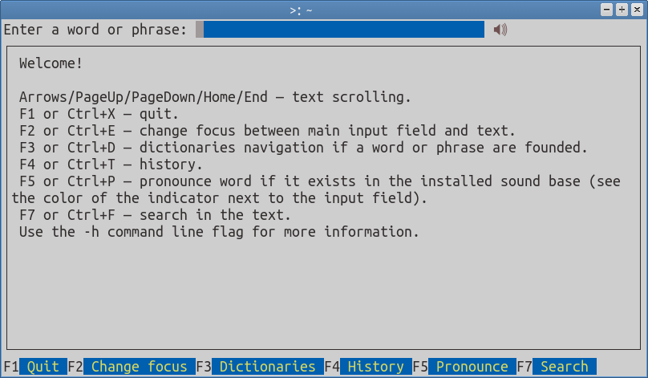

# tuidict
TUI for sdcv — console version of StarDict program  
Used [tview](https://github.com/rivo/tview) library  


## Installation

1) install sdcv https://github.com/Dushistov/sdcv  
2) install [go](https://github.com/golang/go) v1.13 or later and then
```
go get -u github.com/takiz/tuidict
```
3) install [mpv](https://github.com/mpv-player/mpv) or any other audio player for pronunciation of words (i prefer [spl](https://github.com/takiz/spl))

## Usage
```
tuidict [options]
  -dict-dir string
    	Set the directory with dictionary files (default "/usr/share/stardict/dic")
  -history-size int
    	Set history size (default 10)
  -noauto
    	Disable autocompletion
  -player string
    	Set audio player (default "mpv")
  -sdcv string
    	Set sdcv custom arguments (default "-c -n")
  -sound-dir string
    	Set the directory with sound files (default "/usr/share/stardict/sounds")
  -version
    	Print current version
```
        